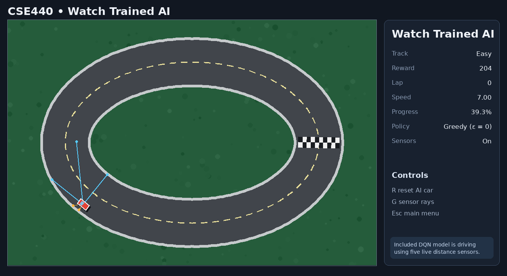
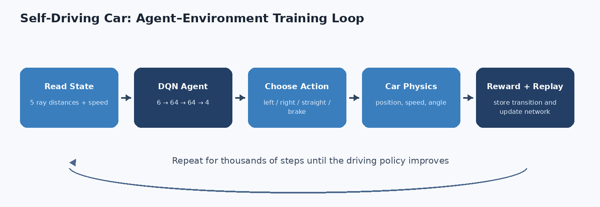

# CSE440 Self-Driving Car Racing Game

A complete 2D racing game in which a car learns to drive using **Deep Q-Network (DQN) reinforcement learning**. The project uses Python, Pygame, PyTorch, NumPy, Pillow, and Matplotlib and is designed to train on a normal CPU-only laptop.



## What is included

- A polished Pygame menu and live game interface.
- Keyboard-controlled manual racing.
- Three image-based track difficulties: easy, medium, and hard.
- Five ray sensors plus speed as the six-value AI state.
- Four discrete actions: turn left, turn right, go straight, and brake.
- A `6 → 64 → 64 → 4` PyTorch DQN.
- Experience replay, epsilon-greedy exploration, target network updates, gradient clipping, and optional Double DQN targets.
- Live start, pause, continue, speed, and save controls during training.
- Model save/load through `.pth` checkpoints.
- Headless CLI training and evaluation.
- Reward, lap-time, and collision graphs.
- Validated trained checkpoints for Easy, Medium, and Hard.
- Automated tests and GitHub Actions CI.
- A polished editable project report and presentation in `submission/`, plus report source, demo script, viva answers, and guides in `docs/`.

## Verified included result

The package includes validated `*_best.pth` checkpoints for Easy, Medium, and Hard. Easy was trained directly; Medium and Hard were produced by curriculum continuation from the previous difficulty, then each checkpoint was evaluated greedily from its standard start position.

| Measurement | Result |
|---|---:|
| Training episodes | 300 |
| Exploratory training episodes completing a lap | 110 / 300 (36.7%) |
| Average reward over the final 50 training episodes | 614.7 |
| Greedy evaluation episodes | 20 |
| Greedy evaluation success | 20 / 20 (100%) |
| Greedy evaluation collisions | 0 |
| Mean greedy lap length | 295 simulation steps (4.92 s at 60 FPS) |

The complete raw Easy metrics and graphs are under `results/pretrained_easy_300_episodes/`. Curriculum-training logs for Medium and Hard are under `results/pretrained_medium_curriculum/` and `results/pretrained_hard_curriculum/`.

| Packaged best checkpoint | 20-episode greedy success | Collisions | Mean reward | Mean lap steps |
|---|---:|---:|---:|---:|
| Easy | 20/20 | 0 | 631.0 | 295 |
| Medium | 20/20 | 0 | 576.0 | 241 |
| Hard | 20/20 | 0 | 593.0 | 259 |

Evaluation is deterministic from each track's standard start pose. These figures demonstrate reproducible packaged-track behavior; they are not a claim about arbitrary starts or real-world driving.

## Fastest Windows setup

1. Install **64-bit Python 3.10 or newer** and enable “Add Python to PATH.”
2. Double-click `setup_windows.bat`.
3. Double-click `run_game.bat`.
4. Select **Watch Trained AI** with Easy, Medium, or Hard to run the included validated checkpoint immediately.

The setup script creates `.venv`, installs all dependencies, and validates the generated track assets.

## Command-line usage

```bash
# Install
python -m venv .venv
.venv\Scripts\activate
python -m pip install -r requirements.txt

# Open the full Pygame app
python main.py gui

# Train without rendering (faster)
python main.py train --track easy --episodes 500

# Evaluate a model over 20 greedy episodes
python main.py evaluate --track easy --model models/easy_best.pth --episodes 20

# Recreate all track images and metadata
python main.py generate-assets --force

# Print the state/action/reward configuration
python main.py describe
```

On macOS or Linux, activate the environment with `source .venv/bin/activate`.

## GUI modes and controls

### Main menu

- **Manual Drive** — control the car with the keyboard.
- **Train AI (DQN)** — watch reinforcement learning happen live.
- **Watch Trained AI** — run a saved model with exploration disabled.
- **Evaluate Trained AI** — run 20 headless test episodes and save JSON results.
- **Settings** — choose the track, car colour, and training episode count.

### Manual driving

| Key | Action |
|---|---|
| Up | Accelerate |
| Down | Brake |
| Left / Right | Steer |
| `R` | Reset after a collision |
| `G` | Show/hide sensors |
| `Esc` | Return to the main menu |

### Live training

| Key | Action |
|---|---|
| Space | Pause or continue |
| `+` / `-` | Increase or decrease simulation steps per rendered frame |
| `S` | Save the current checkpoint |
| `G` | Show/hide sensors |
| `Esc` | Save and return to the main menu |

## Reinforcement-learning design



### State

```text
[left, front_left, front, front_right, right, speed]
```

All six values are normalized to `[0, 1]`. The five sensor rays stop when they encounter a black pixel in the track mask or reach maximum range.

### Actions

| Index | Action | Control applied |
|---:|---|---|
| 0 | Turn left | throttle + left steering |
| 1 | Turn right | throttle + right steering |
| 2 | Go straight | throttle |
| 3 | Brake | braking, no steering |

### Reward function

| Situation | Reward |
|---|---:|
| Driving forward | `+1` |
| Passing a checkpoint | `+20` |
| Completing a lap | `+100` |
| Collision | `-100` |
| Driving backwards | `-10` |
| Standing still | `-2` |

### Network

```text
Input: 6 values
Hidden layer: 64 ReLU units
Hidden layer: 64 ReLU units
Output: 4 action Q-values
```

The policy network learns from random batches in replay memory. A separate target network stabilizes the Bellman target. Epsilon decreases linearly from `1.00` to `0.05`, changing the agent from mostly exploratory behavior to mostly learned behavior.

## Project structure

```text
CSE440-project-self-driving-car-game/
├── ai/
│   ├── agent.py              # epsilon-greedy DQN and checkpointing
│   ├── live_trainer.py       # non-blocking GUI training
│   ├── network.py            # 6-64-64-4 PyTorch model
│   ├── replay_buffer.py      # experience replay memory
│   └── trainer.py            # headless train/evaluate loops
├── assets/tracks/            # coloured tracks, masks, metadata
├── docs/                     # report, presentation, guide, viva, demo
├── game/
│   ├── app.py                # Pygame screens and controls
│   ├── car.py                # vehicle kinematics
│   ├── environment.py        # state, actions, rewards, episodes
│   ├── renderer.py           # visual interface
│   ├── sensors.py            # five distance rays
│   └── track.py              # image masks and track generation
├── models/                   # included and newly trained checkpoints
├── results/                  # CSV, JSON, and graphs
├── scripts/                  # asset and documentation generators
├── tests/                    # 20 automated tests
├── config.py                 # central settings
├── main.py                   # CLI entry point
└── requirements.txt
```

## Training outputs

Every run gets a timestamped directory under `results/` containing:

- `run_config.json` — exact environment and training settings;
- `metrics.csv` — one row per episode;
- `summary.json` — aggregate and full episode data;
- `reward_per_episode.png`;
- `lap_time_per_episode.png`;
- `collision_count_per_episode.png`.

Models are written to:

- `models/<track>_best.pth` — highest completed/reward score seen in the run;
- `models/<track>_latest.pth` — resumable checkpoint.

## Testing

```bash
python -m pip install -r requirements-dev.txt
python -m compileall -q .
pytest -q
```

The current suite contains 19 tests covering tracks, collision masks, car physics, sensors, the six-value environment contract, rewards, DQN dimensions, replay sampling, optimization, checkpoint round trips, a training smoke run, and the included model completing a full lap.

## Honest scope and limitations

- Validated pretrained checkpoints are included for **Easy, Medium, and Hard**. Each packaged best checkpoint completed 20/20 deterministic greedy evaluation episodes from its standard start position with zero collisions. These results do not prove random-start generalization.
- The physics are deliberately simple and educational, not a realistic vehicle simulator.
- The default evaluation uses a fixed start pose. Random-start generalization would require additional training and evaluation.
- DQN results can vary with seed and hyperparameters. Raw logs are kept so results can be inspected rather than merely claimed.
- This project demonstrates reinforcement learning; it is not software for controlling a real vehicle.

## Submission package

The `submission/` folder contains:

- `CSE440_Self_Driving_Car_Project_Report.docx` — a fully formatted 12-page report;
- `CSE440_Self_Driving_Car_Presentation.pptx` — a fully editable 13-slide presentation;
- `README.md` — the final identity/contribution fields that must be filled before course submission.

The team names, IDs, section, faculty name, date, and contribution table remain explicit placeholders because those details were not supplied. The technical content and measured results are already populated.

## Course materials

- `docs/PROJECT_REPORT.md` — near-final written report.
- `docs/PRESENTATION_OUTLINE.md` — slide-by-slide presentation content.
- `docs/DEMO_SCRIPT.md` — concise live demonstration sequence.
- `docs/VIVA_QA.md` — likely viva questions with clear answers.
- `docs/TECHNICAL_DESIGN.md` — detailed implementation and algorithm design.
- `docs/USER_GUIDE.md` — installation, controls, training, and troubleshooting.
- `docs/FINAL_CHECKLIST.md` — submission checklist.
- `docs/reference/Original_Self_Driving_Car_Project_Plan_CSE440.docx` — the supplied source plan preserved unchanged.
