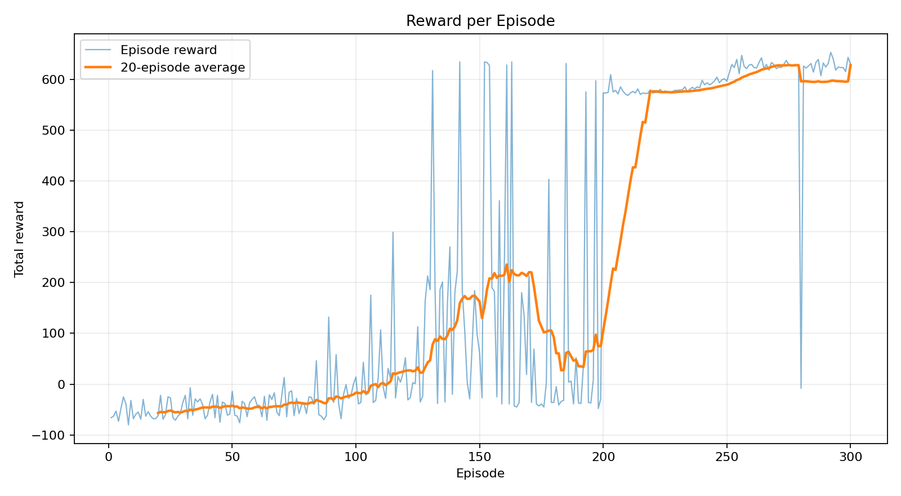
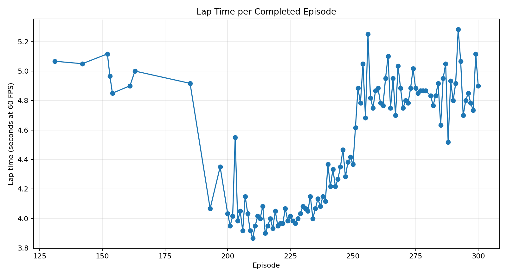
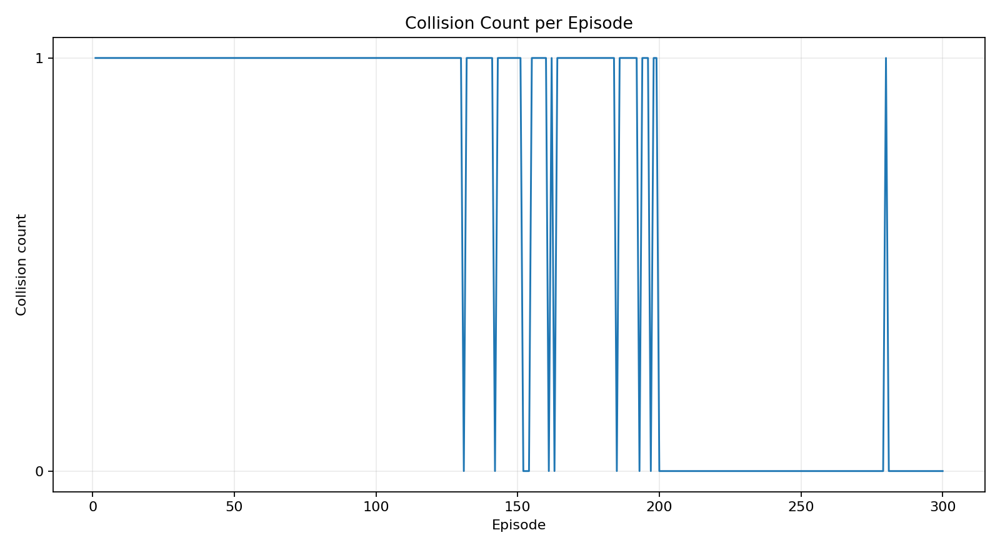

# Self-Driving Car Racing Game Using Deep Q-Network Reinforcement Learning

**Course:** CSE440 – Introduction to Artificial Intelligence  
**Students:** _Add names and IDs_  
**Section:** _Add section_  
**Faculty:** _Add faculty name_  
**Submission date:** _Add date_

---

## Abstract

This project implements a two-dimensional racing game in which an artificial-intelligence agent learns to drive a car through interaction with a simulated environment. The system is built in Python. Pygame provides the interactive game interface, Pillow and NumPy provide image-based tracks and collision masks, PyTorch implements the Deep Q-Network (DQN), and Matplotlib produces evaluation graphs. The agent observes five wall-distance sensor values and the current speed, then chooses one of four actions: turn left, turn right, go straight, or brake. It learns from scalar rewards for forward progress, checkpoints, lap completion, collisions, backward movement, and remaining stationary.

The implementation includes keyboard driving, three track difficulties, live and headless training, experience replay, epsilon-greedy exploration, a target network, model saving/loading, deterministic evaluation, and graphs for reward, lap time, and collisions. In the included 300-episode easy-track run, 110 exploratory training episodes completed a lap. During the final 50 training episodes, the mean reward was 614.7. The selected model then completed 20 of 20 greedy evaluation episodes from the standard start position with no collision and a mean lap length of 295 simulation steps. These results show that a compact DQN can learn a reproducible driving policy in a lightweight CPU-based environment.

## 1. Introduction

Reinforcement learning studies how an agent can improve its behavior by interacting with an environment and receiving rewards rather than receiving the correct action for every situation. A self-driving racing game is a useful educational example because the agent must repeatedly sense the road, choose steering behavior, observe the result, and update its policy.

The goal was not to build a full physical driving simulator. The goal was to make the major artificial-intelligence concepts visible and testable:

- agent–environment interaction;
- state and action design;
- reward engineering;
- exploration versus exploitation;
- neural-network value approximation;
- experience replay;
- training, saving, and evaluation.

The completed application runs on a normal laptop and does not require a GPU.

## 2. Problem Statement

A car must complete a closed 2D track without touching the non-road area. The AI is not given a sequence of correct turns. It receives only five local distance measurements and its speed. It must learn which discrete action has the highest expected future reward for each observed state.

The main technical challenges are:

1. creating a stable but simple car environment;
2. representing the track in a form usable by both collision detection and sensors;
3. designing a reward function that encourages complete laps rather than unsafe shortcuts;
4. stabilizing DQN learning on a CPU;
5. measuring progress with reproducible metrics.

## 3. Objectives

The project objectives were to:

1. build a playable Pygame racing game;
2. implement position, speed, heading, steering, acceleration, braking, and collision;
3. use white-road/black-wall image masks;
4. add five ray-distance sensors;
5. represent the AI state as five sensor values plus speed;
6. implement the four required actions;
7. implement the specified reward table;
8. create a `6 → 64 → 64 → 4` DQN in PyTorch;
9. use experience replay and epsilon-greedy exploration;
10. train and evaluate models on a normal laptop;
11. save and reload `.pth` checkpoints;
12. display live episode, reward, lap, speed, epsilon, and loss information;
13. produce reward, lap-time, and collision graphs.

## 4. Scope

### 4.1 Included

- one AI-controlled car;
- manual and AI driving;
- easy, medium, and hard tracks;
- three selectable car colors;
- DQN reinforcement learning;
- live and headless training;
- saved models and raw metrics;
- deterministic evaluation;
- automated tests.

### 4.2 Excluded

- realistic tire, suspension, or engine simulation;
- multiple competing cars;
- camera-image input;
- real-road deployment;
- safety-critical vehicle control.

## 5. Technology Selection

| Part | Technology | Purpose |
|---|---|---|
| Programming language | Python | Main implementation language |
| Game interface | Pygame | Window, controls, drawing, live training view |
| Neural network | PyTorch | DQN forward pass, loss, optimizer, checkpoint |
| Numeric processing | NumPy | State arrays, track centerline, sensor calculations |
| Track images | Pillow | Deterministic PNG masks and display graphics |
| Graphs | Matplotlib | Reward, lap-time, and collision plots |
| Testing | Pytest | Automated verification |

## 6. System Architecture


The training loop is:

1. reset the environment and place the car at the start line;
2. read the five sensor distances and speed;
3. choose a random action or the highest-Q action;
4. update car speed, angle, and position;
5. check road pixels, checkpoints, progress, and lap completion;
6. calculate the reward;
7. store `(state, action, reward, next_state, done)` in replay memory;
8. sample a random batch and update the policy network;
9. periodically copy policy weights to the target network;
10. repeat until collision, lap completion, stuck termination, or time limit.

## 7. Game Environment

### 7.1 Coordinate and motion model

The screen uses the normal image coordinate system: positive `x` points right and positive `y` points down. The car stores position `(x, y)`, heading angle, and speed.

The basic motion is:

\[
x_{t+1}=x_t+\cos(\theta_t)v_t
\]

\[
y_{t+1}=y_t+\sin(\theta_t)v_t
\]

\[
\theta_{t+1}=\theta_t+s_t\Delta\theta
\]

\[
v_{t+1}=\operatorname{clip}(v_t+a_t-b_t-f,0,v_{max})
\]

where `s` is steering, `a` is acceleration, `b` is braking, and `f` is rolling resistance. The model intentionally remains simple so the AI concepts are easy to explain.

### 7.2 Image-based track

Each difficulty has:

- a colored PNG for display;
- a grayscale mask with white road and black non-road;
- JSON metadata containing the centerline, checkpoints, road width, and start pose.

The car has nine collision probe points around its body. A collision occurs when any probe is outside the white road mask.

### 7.3 Progress and checkpoints

The track centerline contains 720 ordered points. The environment searches locally around the previous centerline index, which prevents a crash near another part of the track from producing a false progress jump. Twelve evenly spaced checkpoints divide a lap. A checkpoint can be rewarded only in forward order.

## 8. Sensor and State Design

The car emits five rays at relative angles:

\[
[-90^\circ,-45^\circ,0^\circ,45^\circ,90^\circ]
\]

Each ray advances until it reaches a black pixel or the maximum range. Distances are normalized by maximum range. Speed is normalized by maximum speed.

The six-value state is:

```text
[left, front_left, front, front_right, right, speed]
```

This representation is compact, interpretable, and sufficient for the closed tracks used in the project.

## 9. Action Space

| Action index | Action | Throttle | Steering | Brake |
|---:|---|---:|---:|---:|
| 0 | Turn left | 1 | -1 | 0 |
| 1 | Turn right | 1 | +1 | 0 |
| 2 | Go straight | 1 | 0 | 0 |
| 3 | Brake | 0 | 0 | 1 |

A small discrete action space makes DQN appropriate and keeps training understandable.

## 10. Reward Function

| Situation | Reward |
|---|---:|
| Driving forward | `+1` |
| Passing a checkpoint | `+20` |
| Completing a lap | `+100` |
| Collision | `-100` |
| Driving backwards | `-10` |
| Standing still | `-2` |

Forward movement is detected from ordered centerline progress. Backward progress receives the specified negative reward. The checkpoint and lap rewards provide longer-term goals, while collision and stationary penalties discourage unsafe or inactive behavior.

Reward engineering was critical. A neural network cannot compensate for a reward function that encourages the wrong objective.

## 11. Deep Q-Network

### 11.1 Network architecture

The policy network is deliberately small:

```text
6 inputs → 64 ReLU → 64 ReLU → 4 Q-values
```

The output `Q(s,a)` estimates the expected discounted return for each action.

### 11.2 Bellman target

For a transition `(s, a, r, s', done)`, the DQN target is:

\[
y=r+\gamma(1-done)\max_{a'}Q_{target}(s',a')
\]

The implementation uses the Huber loss between `Q_policy(s,a)` and `y`. By default, Double DQN action selection is enabled:

\[
a^*=\arg\max_{a'}Q_{policy}(s',a')
\]

\[
y=r+\gamma(1-done)Q_{target}(s',a^*)
\]

This preserves the DQN structure while reducing overestimation.

### 11.3 Experience replay

Transitions are stored in a fixed-size replay buffer. Training uses random mini-batches instead of only the newest transition. This reduces temporal correlation and allows one experience to contribute to multiple updates.

### 11.4 Target network

The policy network changes during optimization. A separate target network is updated periodically, making the target values more stable.

### 11.5 Epsilon-greedy exploration

The agent chooses a random action with probability `ε`; otherwise it chooses the largest Q-value. Epsilon decreases linearly from `1.00` to `0.05`. Early training therefore explores many behaviors, while later training mostly follows the learned policy.

## 12. Training Configuration

The included run used the following important settings:

| Hyperparameter | Value |
|---|---:|
| Episodes | 300 |
| Discount factor `γ` | 0.99 |
| Learning rate | 0.001 |
| Batch size | 64 |
| Replay capacity | 50,000 |
| Replay warm-up | 500 transitions |
| Target update interval | 600 environment steps |
| Epsilon start | 1.00 |
| Epsilon end | 0.05 |
| Epsilon decay | 25,000 steps |
| Hidden units | 64 and 64 |
| Device | CPU |
| Seed | 440 |

The exact configuration is stored in `results/pretrained_easy_300_episodes/run_config.json`.

## 13. Training and Evaluation Results

### 13.1 Training summary

| Measurement | Result |
|---|---:|
| Total episodes | 300 |
| Episodes completing a lap during exploration | 110 |
| Training success rate | 36.7% |
| Best exploratory episode reward | 653.0 |
| Final-50 mean reward | 614.7 |
| Mean time among completed training laps | 4.51 s |
| Total training collisions | 190 |

The training success rate includes high-epsilon exploratory episodes. Random actions can cause a collision even after a useful policy has been learned, so final policy quality must be measured separately with `ε = 0`.

### 13.2 Greedy evaluation

| Track | Episodes / completed laps | Success | Collisions | Mean reward | Mean lap length |
|---|---:|---:|---:|---:|---:|
| Easy | 20 / 20 | 100% | 0 | 631.0 | 295 steps |
| Medium | 20 / 20 | 100% | 0 | 576.0 | 241 steps |
| Hard | 20 / 20 | 100% | 0 | 593.0 | 259 steps |

Evaluation used each track's standard start position with no random actions (`ε = 0`). Raw results are stored in `results/easy_pretrained_evaluation_20.json`, `results/medium_pretrained_evaluation_20.json`, and `results/hard_pretrained_evaluation_20.json`. Medium and Hard use curriculum continuation from easier checkpoints, so this evidence does not claim independent from-scratch convergence or arbitrary-start generalization.

### 13.3 Graphs

#### Reward per episode



The reward curve becomes strongly positive as the agent begins passing more checkpoints and completing laps. Individual values remain noisy because training still includes exploration.

#### Lap time per completed episode



Completed-lap times stabilize as the policy learns a repeatable route.

#### Collision count per episode



Each training episode ends either through a collision, a completed lap, being stuck, or a time limit. Later training contains many more zero-collision lap completions.

## 14. User Interface

The Pygame application contains:

- a main menu;
- manual driving;
- live DQN training;
- trained-model playback;
- automatic evaluation;
- track, car-color, and episode settings;
- live sensor rays;
- episode, reward, speed, lap, epsilon, loss, and training-speed display;
- pause, continue, save, reset, and return controls.


## 15. Model Saving and Reuse

Checkpoints contain:

- policy-network weights;
- target-network weights;
- optimizer state;
- network dimensions;
- training configuration;
- global environment and optimization step counts;
- metadata such as track, episode, reward, and evaluation result.

After loading `model.pth`, the policy can drive immediately without retraining.

## 16. Testing and Reliability

The project includes 20 automated tests covering:

- track images and masks;
- start-pose safety;
- local centerline progress;
- acceleration, steering, and braking;
- sensor shape and range;
- six-value state contract;
- exact stationary reward;
- complete-lap environment behavior;
- network layer dimensions;
- replay-buffer sampling;
- DQN optimization;
- checkpoint save/load;
- headless training outputs;
- the included model completing a lap without collision.

The test suite completes in a few seconds on CPU.

## 17. Discussion

The results demonstrate that a small network can learn the easy track from compact range sensors. The improvement is not caused by a scripted driving controller: the included model is a learned PyTorch policy trained from replayed environment transitions.

Several implementation choices improved reliability:

- local centerline search prevented false checkpoint jumps;
- ordered checkpoints prevented repeated reward exploitation;
- a target network reduced unstable targets;
- replay memory reused experiences and reduced correlation;
- epsilon decay balanced early exploration and later exploitation;
- raw CSV/JSON files made results auditable;
- headless training avoided rendering overhead;
- deterministic track generation removed missing-asset problems.

The difference between exploratory training success and greedy evaluation success is also important. Training behavior intentionally contains random actions. Evaluation must disable randomness to measure the policy itself.

## 18. Limitations

1. Packaged checkpoint evaluation begins from each track's standard start pose; random-start generalization is not established.
2. Medium and Hard use curriculum continuation from an easier checkpoint rather than independent from-scratch training.
3. The sensor state does not include previous actions or angular velocity.
4. Car physics are educational rather than realistic.
5. One environment runs at a time; training is not vectorized.
6. DQN may require retuning for narrower or highly irregular tracks.
7. The project does not represent real-road perception or safety.

## 19. Future Work

Possible extensions include:

- benchmark from-scratch versus curriculum training on Medium and Hard;
- randomize starting positions and headings;
- compare curriculum schedules and transfer strategies;
- compare DQN with PPO;
- add prioritized replay;
- include recurrent state for temporal memory;
- add multiple cars or obstacles;
- use camera images with a convolutional network;
- add a model-comparison screen;
- export training videos and richer dashboards.

## 20. Conclusion

The project meets its central objective: it provides a complete, explainable, CPU-friendly racing game in which a DQN agent learns from agent–environment interaction. The implementation connects the full reinforcement-learning pipeline—state, action, reward, replay, exploration, neural-network update, model saving, and evaluation—to a visible Pygame application. The included Easy, Medium, and Hard checkpoints and raw evaluations provide reproducible evidence that the DQN can complete each packaged track from its standard start pose.

## 21. Team Contributions

Replace this section with the actual team contribution record.

| Member | ID | Contributions |
|---|---|---|
| _Name_ | _ID_ | _Example: game physics, collision, UI_ |
| _Name_ | _ID_ | _Example: sensors, DQN, training_ |
| _Name_ | _ID_ | _Example: testing, report, presentation_ |

## References

1. V. Mnih et al., “Human-level control through deep reinforcement learning,” *Nature*, 2015.
2. R. S. Sutton and A. G. Barto, *Reinforcement Learning: An Introduction*, second edition.
3. PyTorch documentation, neural-network modules, optimizers, and model serialization.
4. Pygame documentation, display, event, keyboard, surface, and drawing modules.
