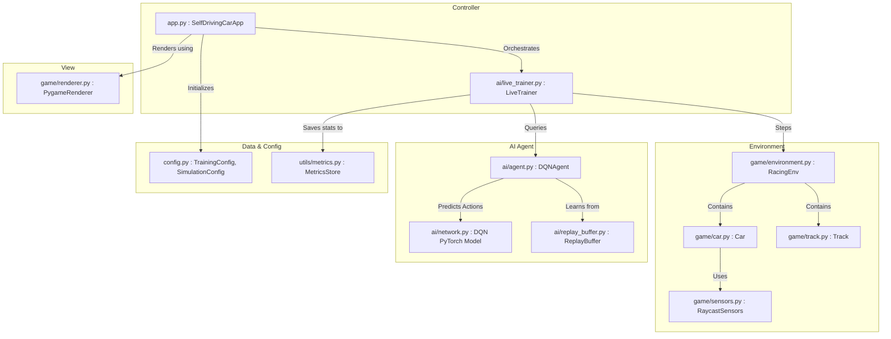
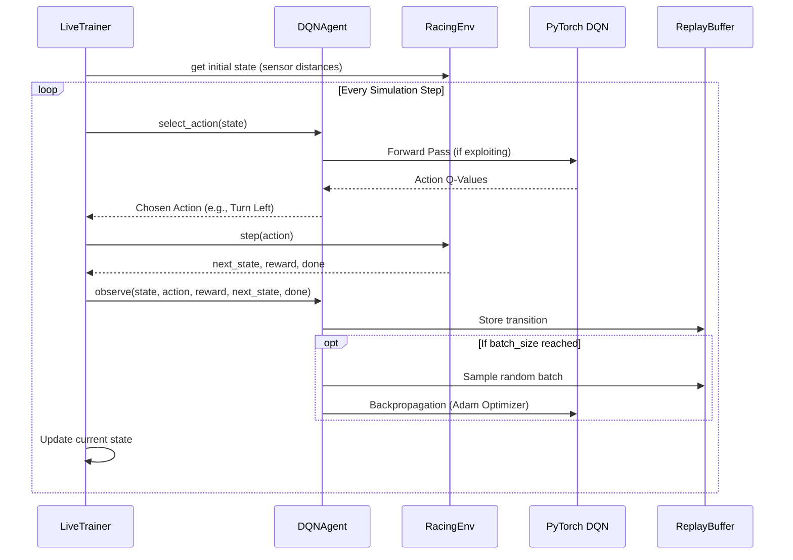

# System Architecture: Autonomous Vehicle Reinforcement Learning

This document outlines the complete architectural design of the Pygame + PyTorch Self-Driving Car project. The system is built using a decoupled architecture separating the rendering engine, the simulation physics, and the AI brain, allowing for seamless live training and robust evaluation.

## 1. High-Level Architecture Overview

The project follows a standard **Model-View-Controller (MVC) / Agent-Environment** design pattern tailored for Reinforcement Learning (RL):

- **Environment (Physics & Simulation)**: Simulates the track, car physics (acceleration, friction, steering), raycasting sensors, and collision detection.
- **Agent (AI Brain)**: A Deep Q-Network (DQN) model that observes the environment via sensors and makes steering decisions to maximize reward.
- **View (Renderer)**: Pygame-based UI that visually represents the simulation, draws menus, and plots real-time evaluation graphs.
- **Controller (App / Trainer)**: Orchestrates the interaction between the Environment, Agent, and View, handling state transitions and game loops.

## 2. Component Diagram

## 3. Core Modules Deep Dive

### 3.1. Game Environment (`game/`)
* **`app.py`**: The main entry point. Manages application state (`menu`, `training`, `evaluation`, `evaluation_metrics`), handles input events, and loops at a constant framerate.
* **`environment.py` (`RacingEnv`)**: The Gym-like interface. Accepts an `action` (Turn Left, Straight, Turn Right, Brake), updates the car's position, checks for collisions against the track boundary (and traffic), and calculates the `reward`. It returns `(next_state, reward, terminated, truncated, info)`.
* **`car.py`**: Handles 2D rigid-body kinematics (velocity, acceleration, drag, rotation).
* **`sensors.py`**: Implements raycasting. It shoots 5 conceptual "lasers" out of the front of the car, calculating line-segment intersections with track boundaries to provide normalized distance readings.
* **`renderer.py`**: Handles all Pygame drawing logic, abstracting UI away from logic. Includes dynamic scaling for fullscreen and real-time line graph plotting for training/eval metrics.

### 3.2. AI & Reinforcement Learning (`ai/`)
* **`agent.py` (`DQNAgent`)**: The RL controller. Uses an epsilon-greedy policy. Epsilon decays over time to shift from exploration to exploitation. It features a target network to stabilize learning.
* **`network.py` (`DQN`)**: A PyTorch Feed-Forward Neural Network. It takes a 5-dimensional input vector (sensor readings) and outputs a 4-dimensional vector representing the Q-value for each possible action.
* **`replay_buffer.py`**: Experience Replay. Stores past transitions `(state, action, reward, next_state, done)`. During training, the agent samples random mini-batches from this buffer to break correlation between consecutive frames and prevent catastrophic forgetting.
* **`live_trainer.py` (`LiveTrainer`)**: A non-blocking training orchestrator. It executes `N` simulation steps per visual frame, allowing the AI to train significantly faster than real-time while still rendering the output smoothly to Pygame.

## 4. Reinforcement Learning Interaction Loop

## 5. File System & Persistence

The system continuously checkpoints its state to prevent data loss and allow future evaluation:
- **`models/`**: Saves PyTorch `.pth` files. It saves the `latest` model (for resuming) and the `best` model (highest score).
- **`results/`**: Stores telemetry (rewards, lap times, collisions) in CSV/JSON formats, alongside plotted `matplotlib` PNG graphs.
- **State Hydration**: When the user clicks "Evaluate", `app.py` hydrates the PyTorch network using `DQNAgent.from_checkpoint()` and extracts the saved `TrainingConfig` metadata to accurately replay the model under identical conditions.

## 6. Real-time Plotting Subsystem

The UI integrates a live plotting mechanism within `renderer.py`:
1. `MetricsStore` captures rewards at the end of each episode.
2. `LiveTrainer` exposes the last 50 episodes.
3. The Renderer dynamically calculates bounding boxes on the right-side control panel.
4. Pygame drawing primitives (`pg.draw.lines`) render normalized X/Y coordinates in real-time, providing immediate visual feedback of reward convergence or divergence.
